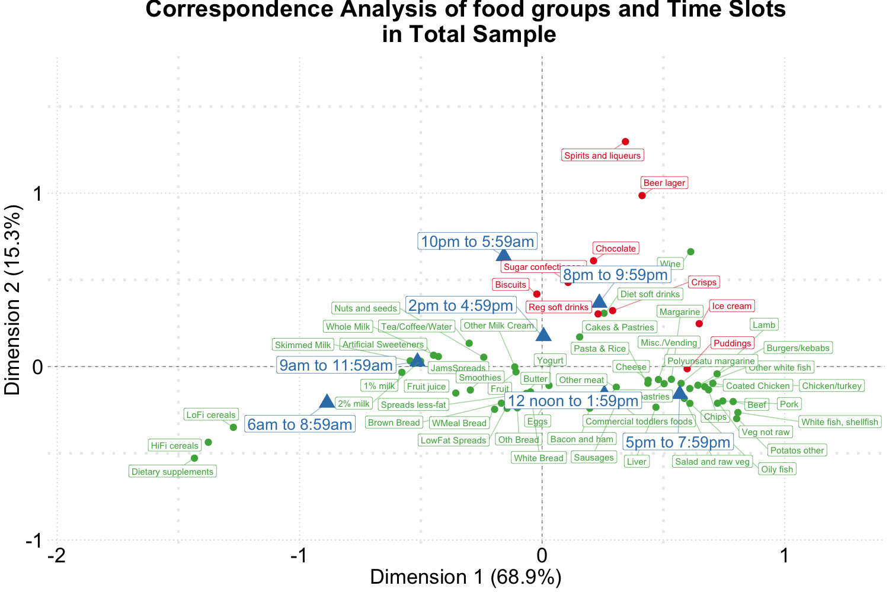
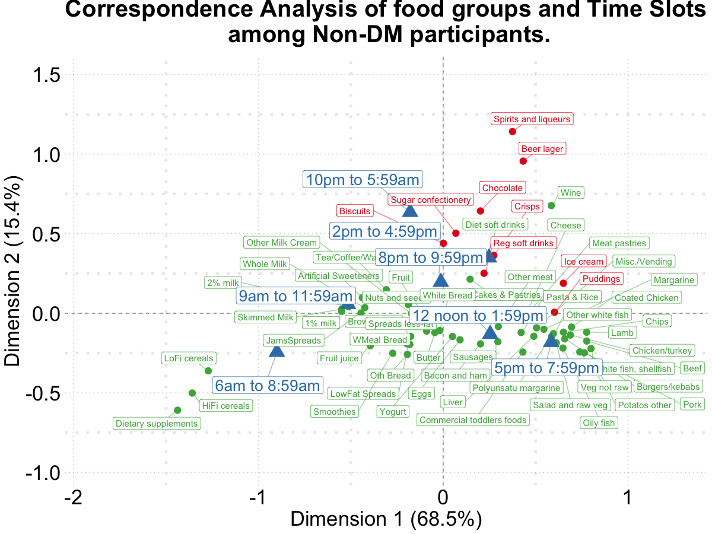
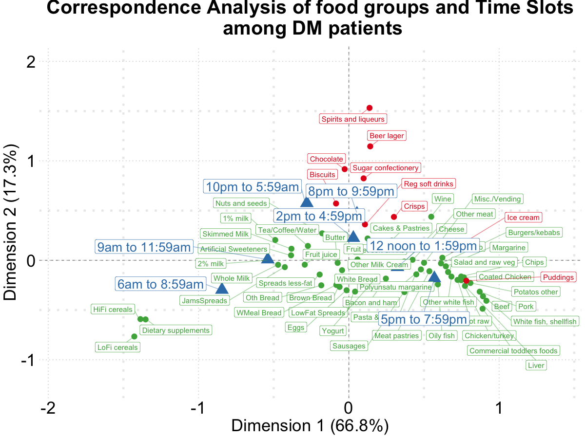
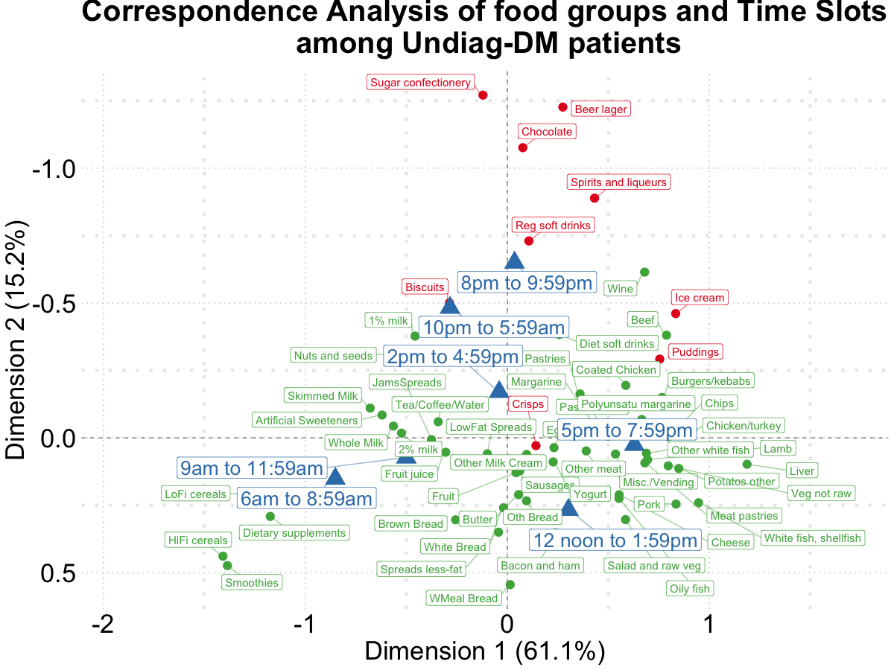
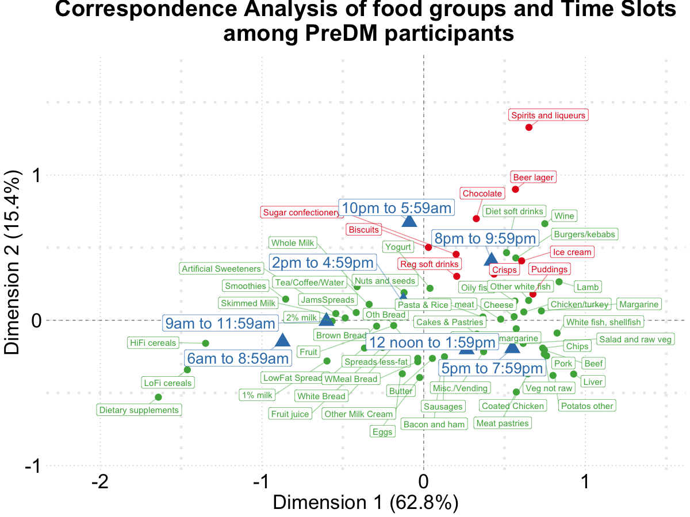

<div class="redoc" id="redoc-codechunk-1">


</div>

1. Department of Public Health, Aichi Medical University, Nagakute, Aichi, JAPAN (C.W.);
3. Brain, Performance and Nutrition Research Centre, Northumbria University, Newcastle, UK (S.A.);
1. Department of Medical Statistics, London School of Hygiene & Tropical Medicine, London, UK (L.P.)

Corresponding Author: Luigi Palla

Present address for L.P.: Department of Medical Statistics, London School of Hygiene & Tropical Medicine, Keppel Street, London, WC1E 7HT, United Kingdom. (email: Luigi.Palla\<at\>lshtm.ac.uk)

Sources of Support: This work was supported by Grants-in-Aid for Young Scientists (grant number 19K20199 to C.W.) from the Japan Society for the Promotion of Science (JSPS).

Short running head: Time of food consumption by diabetes status.  

<span class="redoc" id="redoc-htmlcomment-1"><!-- #####  --></span>

<span class="redoc" id="redoc-htmlcomment-2"><!-- **Abbreviations:**  --></span>

<span class="redoc" id="redoc-htmlcomment-3"><!-- MLCA, multilevel latent class analysis; T2D, type 2 diabetes; CVD, cardiovascular disease; NDNS RP, National Diet and Nutrition Survey Rolling Programme; PHE, Public Health England; FSA, Food Standards Agency; PSU, primary sampling units; BMI, body mass index; WC, waist circumferences; HDL, high-density lipoprotein; LDL, low-density lipoprotein; TG, triglycerides; HbA1c, hemoglobin A1c; CI, confidence interval. --></span>


##### 

## ABSTRACT

**Background:** Time of eating has been shown to be associated with diabetes and obesity. 

**Objective:**  To identify potential relationships between foods and eating time, and see whether these associations may vary by diabetes status.

**Design:** The National Diet and Nutrition Survey (NDNS) included 6802 adults (age $\geqslant$ 19) collected 749026 food recordings by a 4-day-diary. The contingency table cross-classifying 60 foods with the pre-defined 7-time slots were analyzed by Correspondence Analysis (CA). Biplots displaying the associations were generated for all adults and separately by diabetes status (self-reported, pre-, undiagnosed-, and non-diabetics). Odds ratios (OR, 99% confidence intervals, CI) were derived of consuming unhealthy foods at evening/night (8 pm - 6 am) vs. earlier in the day, by logistic regression models with generalized estimating equation.

**Results:** The biplots suggested positive associations between evening/night and puddings, regular soft drinks, sugar confectioneries, chocolates, spirits, beers, ice cream, biscuits, and crisps. The OR (99% CIs) of consuming these foods at evening/night were respectively 1.38 (1.03, 1.86), 1.74 (1.47, 2.06), 1.92 (1.38, 2.69), 3.19 (2.69, 3.79), 11.13 (8.37, 14.80), 7.19 (5.87, 8.82), 2.38 (1.79, 3.15), 1.91 (1.67, 2.16), 1.55 (1.27, 1.88) vs. earlier time. Stratified biplots found that sweetened beverages, sugar-confectioneries were more likely to be consumed at event/night among undiagnosed diabetics.

**Conclusions:** Foods consumed in the evening/night time tend to be highly processed, easily accessible, and rich in added sugar or saturated fat. Individuals with undiagnosed diabetes are more likely to consume unhealthy foods at night. Further longitudinal studies are required to explore the causality.


##### 

## INTRODUCTION

The timing of energy intake has been shown to be associated with obesity and diabetes. <span class="redoc" id="redoc-citation-1">[@almoosawi2016chrono]</span> Specifically, eating late at night or having a late dinner were found to be related to higher risk of obesity <span class="redoc" id="redoc-citation-2">[@xiao2019meal;@yoshida2018association]</span>,  hyperglycemia <span class="redoc" id="redoc-citation-3">[@nakajima2015association]</span>, metabolic syndrome <span class="redoc" id="redoc-citation-4">[@kutsuma2014potential]</span>, diabetes <span class="redoc" id="redoc-citation-5">[@mattson2014meal]</span>, and poorer glycemic control among diabetics <span class="redoc" id="redoc-citation-6">[@sakai2017late]</span>. However, the relationship between food choice and their time of being consumed during the time of day is left largely unknown. Shiftworkers have an increased risk of obesity <span class="redoc" id="redoc-citation-7">[@balieiro2014nutritional;@barbadoro2013rotating]</span>, and diabetes <span class="redoc" id="redoc-citation-8">[@pan2011rotating]</span>, probably due to limited availability of healthy food choice during their night shifts <span class="redoc" id="redoc-citation-9">[@bonnell2017influences;@balieiro2014nutritional]</span>. Identifying those food that might be chosen during late night time would be helpful when guiding people to change their eating habit for the purpose of either weight losing or maintaining glycemic control. Dietary diary recordings from national surveys provided detailed food choice data for exploration of relationships between food groups and their time of consumption in general population.

We aimed to decribe the relationship between food groups and the time of day when they were consumed, and how such relationships may vary by status of type 2 diabetes.

## METHODS 


6802 adults (2810 men and 3992 women) and 749026 food recordings collected by the UK National Diet and Nutrition Survey Rolling Programme (NDNS RP 2008-17) were analyzed in the current study <span class="redoc" id="redoc-citation-10">[@MRCElsieWiddowsonLaboratory2018]</span>. The sample was randomly drawn from a list of all addresses in the UK, clustered into postcode sectors. Details of the rationale, design and methods of the survey can be found in the previous published reports <span class="redoc" id="redoc-citation-11">[@bates2014national; @roberts2018national]</span>. Time of the day was categorized as 7 slots: 6-9 am, 9-12 noon, 12-2 pm, 2-5 pm, 5-8 pm, and 10 pm - 6 am. Foods recorded were classified into 60 standard food groups with 1 to 10 subgroups each: the details are given in Appendix R of the NDNS offical report <span class="redoc" id="redoc-citation-12">[@NDNSdatabase2018]</span>. We focused on the 60 standard food groups in the current analysis. Diabetes statuses were defined as: 1) healthy if fasting glucose was lower than 6.10 (mmol/L), hemoglobin A1c (HbA1c) were less than 6.5 (%), and without self-reported diabetes or under treatment of diabetes (n = 2626); 2) pre-diabetic if fasting glucose was lower between 6.10 and 6.99 (inclusive) but without self-reported diabetes or under treatment of diabetes (n = 133); 3) undiagnosed diabetic if either fasting glucose was higher or equal to 7.00 (mmol/L) or HbA1c higher or equal to 6.5 (%) but without self-reported diabetes or under treatment of diabetes (n = 99); 4) diabetic if participant had self-reported diabetes or under treatment of diabetes (n = 227). Consequently, number of adults whose diabetes status could not be confirmed was 3717 (1519 men, 2198 women) and they were kept in the whole sample analyses. In addition, the National Statistics Socio-economic Classification <span class="redoc" id="redoc-citation-13">[@rose2005national]</span> were applied in the survey and therefore accordingly, the socio-economic classification for the individuals' household were defined with 8 categories.

Correspondence analysis (CA) <span class="redoc" id="redoc-citation-14">[@greenacre2017correspondence;@Chapman2017]</span> was used as a tool for data mining, visualisation and hypotheses generation using half of the randomly selected NDNS diary entries data. Specifically, the contingency table generated by cross-tabulating foods and time of eating were analyzed by CA. Through CA, the 60 categories of standard food and the 7 time-slot were projected on two dimensions that could jointly contain large percentage of the $\chi^2$ deviation (or inertia) of the table. Biplots that graphically showing the association between time of day and food groups were derived for all adults and seprately according to their diabetes status. To account for the hierarchy of the data (food recorded by the same individuals who lived within the same sampling units) and to calculate population marginal odds ratios (OR), logistic regression models with generalized estimating equations (GEE) were used to test associations that were suggested from biplots generated by CA using the remaining half of the diary entries data. The marginal ORs and their 99% confidence intervals (CI) was derived of consuming unhealthy food groups selected by CA, later in ther day (8 pm - 6 am) compared to earlier in the day. CA and biplots were conducted and generated by the following packages under R environment <span class="redoc" id="redoc-citation-15">[@Rcoreteam]</span>: `FactoMineR, factoextra, ggplot2, ggrepel` <span class="redoc" id="redoc-citation-16">[@L__2008;@factoextra;@ggplot2;@ggrepel]</span>. Logistic regression models with GEE were performed with SAS procedure `GENMOD` <span class="redoc" id="redoc-citation-17">[@SAS94]</span> adjusted for age, sex, and social economic levels. 

## RESULTS

The dataset consisted of 2810 (41.3%) men and 3992 (58.7%) women aged older than or equal to 19 years old with the mean age of 49.9 years (standard deviation, sd = 17.6). Among these individuals 22.6 % of them were current smokers, 24.3 % were past smokers. The average body mass index (BMI) was 27.7 kg/m$^2$ (sd = 5.41). Among the food recordings collected, 56.9% were recorded during traditional breakfast (6 am - 9 am: 14.3%), lunch (12 noon - 2 pm: 18.5%), or dinner (5 pm - 8 pm: 24.1%) time slots. Table 1. shows the top 37 food groups that contributed to 90% of the total calories consumed by adults in NDNS RP. These food groups accounted for 478028 of the total diary entries (63.8 %). The random process splitted the data of food recordings into a hypothesis generating dataset of 374682 and a testing dataset of 374344. 




Figure 1-5 are CA biplots that summarize the associations between 60 food groups and the time of their consumption in total sample and stratified by their diabetes status. In Figure 1, the horizontal axis explains 68.9 % the correlation between food and time while the verticle axis reflects 15.3 % of the same relationship. Therefore, a total of 84.2 % of the inertia between food and time were captured in this figure which shows a visual summary of how the two variables are related. Specifically, time slots later than 8 pm are shown in the upper side of the figure closer to foods contained alcohol (beers and spirits) or highly processed/energy condensed foods (sugar confectioneries, chocolates, biscuits, regular softdrinks, ice cream, crisps); time earlier than the noon time are shown in the left hand side together with typical breakfast foods (cereals, milk, bread, etc.).



To visualize the potential associations between food groups, time slots and diabetes, CA was conducted according to diabetes status in the NDNS RP dataset (Figure 2-5). Depending on different diabetes status, these biplots explained 76.3% to 84.1% of the inertia in the data. Similar to biplot created from the total sample (Figure 1), later time in the day (8 pm and later) are shown in the upper side of each figure and potentially had association with the alcoholic beverages and highly processed or energy condense food groups. Additionally, some food groups and time slots also flagged up associations potentially different by diabetes status. For example, puddings seemed to be shown more closer towards later time in the day among undiagnosed diabetics (Figure 4) while for diagnosed diabetic patients (Figure 3) they were related with traditional dinner time (5 pm to 8 pm) or earlier in the day. Furthermore, sugar confectioneries/chocolates/biscuits/regular softdrinks appeared to be associated with later time in the day (8 pm or later) more strongly among undiagnosed diabetics (Figure 4) than the others. 



Based on the findings suggested from Figure 1-5, we tested the following hypotheses using logistic regression models (adjusted for age, sex, and socio-economic levels) with GEE: that the odds of consuming any of the following foods including "puddings, regular soft drinks, sugar confectioneries, chocolates, spirits, beers, ice cream, biscuits, crisps" at later time of the day (8 pm - 6 am) is the same compared to earlier in the day; and the associations of the above-mentioned food groups and time slots are the same among participants with different diabetes status. The results are summarized in Table 2. 






The listed food groups were found to be consumed during time between 8 pm and 6 am with higher odds compared to earlier time. The OR (99% CIs) of consuming these foods at evening/night were respectively 1.38 (1.03, 1.86), 1.74 (1.47, 2.06), 1.92 (1.38, 2.69), 3.19 (2.69, 3.79), 11.13 (8.37, 14.80), 7.19 (5.87, 8.82), 2.38 (1.79, 3.15), 1.91 (1.67, 2.16), 1.55 (1.27, 1.88) vs. earlier time. Opposite directions of the association for puddings were detected. The ORs (99% CIs) for consuming puddings at night time (8 pm or later) compared to earlier time were 1.50 (1.10, 2.07),	0.89 (0.16, 4.87),	1.81 (0.41, 7.98), and	0.58 (0.14, 2.43) for healthy, prediabetic, undiagnosed diabetic, and diabetic paticipants, respectively. Furthermore, undiagnosed diabetic patients were found to have higher odds of consuming regular soft drinks (OR: 2.72; 99% CI: 1.44, 5.14), and sugar cofectioneries (OR: 13.07; 99%CI: 4.59, 37.24) during night time periods than earlier time in the day and the other participants. 


<span class="redoc" id="redoc-htmlcomment-4"><!-- <div class="redoc" id="redoc-codechunk-2">
```{r fig1, eval=TRUE, echo=FALSE, out.width= '100%',cache=TRUE, fig.cap="", fig.align='center'} -->
<!--  -->
<!-- ``` 

</div>--></span>
 

## DISCUSSION 


### Conclusions


## ACKNOWLEDGEMENT 

## CONFLIT OF INTEREST (COI) STATEMENT
The authors declared no conflicts of interest.

## AUTHOR'S CONTRIBUTIONS

CW, SA, and LP: designed research and had primary responsibility for final content; CW and LP performed statistical analysis; and all authors: wrote the manuscript, read and approved the final manuscript.

#####

## REFERENCES


